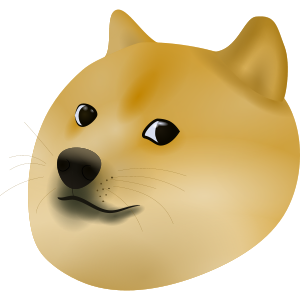
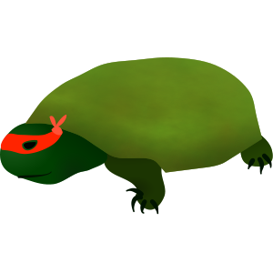
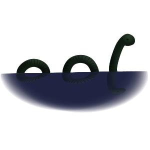
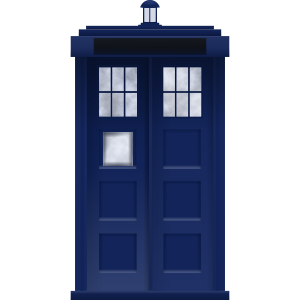
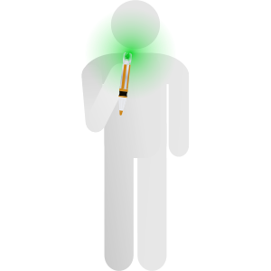
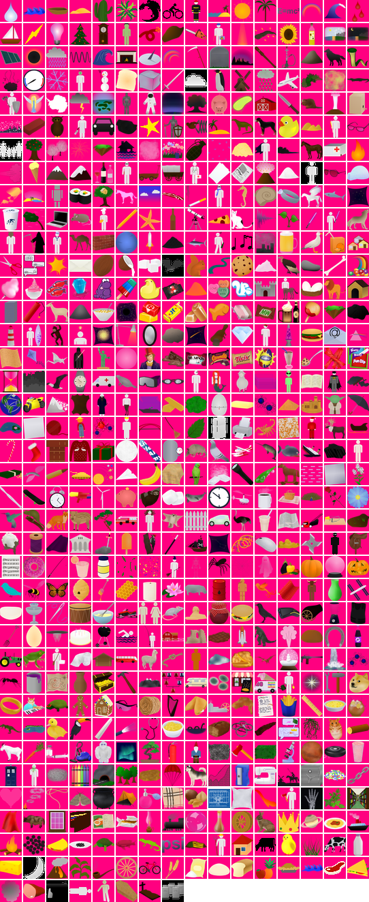

# Little Alchemy Asset Ripper

This project aims to downloads icons from Little Alchemy, processes them, creates a spritesheet, and provide a validation Pygame quiz. Which is meant Handles cases where there are more images than element names.

## Analysis

During the analysis stage, I notice there were more images than the actual names of the elements when reverse engineering the hint's site. I decided to create a quiz game to test and check if images didn't match with the names generated in `validation/names.txt`. The quiz game only uses the names of the elements that are provided in the names list which where found on the hints site. Once done, a validation report will be generated allow us to run analysis on the data. Most of the images that weren't in the names list were actually memes or easter eggs that were added to the game (There was a lot of candy :P ).

Below is a list of the image names that were not in the names list:

| Image Files | Preview |
|-------------|---------|
| 271.png     |  |
| 272.png     |  |
| 273.png     |  |
| 274.png     |  |
| 275.png     |  |
| 276.png     |  |
| 277.png     |  |
| 278.png     |  |
| 279.png     |  |
| 280.png     |  |
| 281.png     |  |
| 292.png     |  |
| 293.png     |  |
| 295.png     |  |
| 296.png     |  |
| 297.png     |  |
| 298.png     |  |
| 299.png     |  |
| 320.png     |  |
| 321.png     |  |
| 322.png     |  |
| 323.png     |  |
| 324.png     |  |
| 325.png     |  |
| 326.png     |  |
| 327.png     |  |
| 328.png     |  |
| 329.png     |  |
| 530.png     |  |
| 531.png     |  |
| 532.png     |  |
| 533.png     |  |
| 553.png     |  |
| 573.png     |  |
| 575.png     |  |
| 576.png     |  |

## Sprite Sheet

## Features

*   Downloads and resizes images (32x32).
*   Handles transparency (alpha channel).
*   Indexed color conversion (8 "8-bit" colors).
*   Spritesheet creation with padding and optional text labels.
*   Pygame-based interactive quiz.
*   Handles more images than provided names (unnamed images are included in the spritesheet without labels, and the quiz only uses named elements).

## Requirements

*   Python 3.7+
*   `Pillow`, `requests`, `pygame`: `pip install Pillow requests pygame`

## Usage

1.  `git clone <repository_url>`
2.  `cd Little-Alchemy-Asset-Ripper`
3.  `python element_downloader.py`

## Configuration

Modify these variables in `if __name__ == "__main__":`:

*   `url_template`: Image URL template (`{number}` placeholder).
*   `start_number`, `end_number`: Image number range.
*   `output_folder`, `spritesheet_output`: Output paths.
*   `names`: List of element names (order matters). Fewer names than images are handled gracefully.
*   `images_per_row`, `padding`: Spritesheet layout options.

## Spritesheet & Quiz

The spritesheet is saved as `elements_spritesheet.png`. The Pygame quiz tests element identification (y/n).

## License

[MIT](/LICENSE)

## Acknowledgements

*   Little Alchemy
*   Little Alchemy hints website
*   ChatGPT / Gemini were used during the development of this project

---
Copyright © 2024 - Alvajoy Asante
